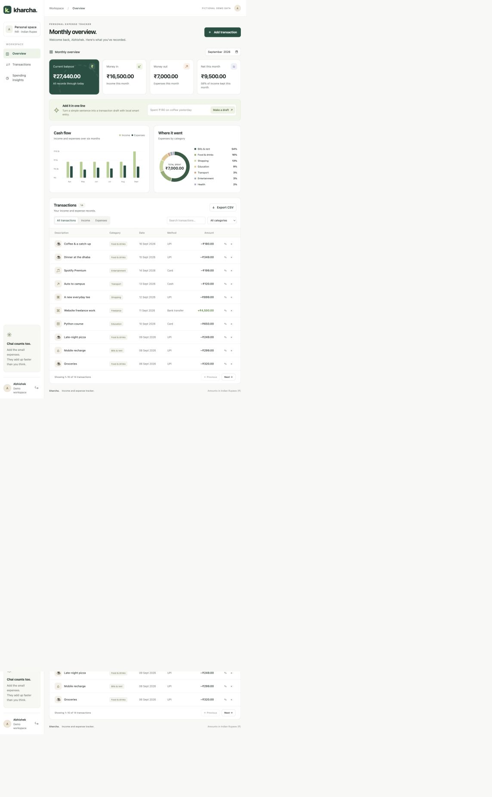
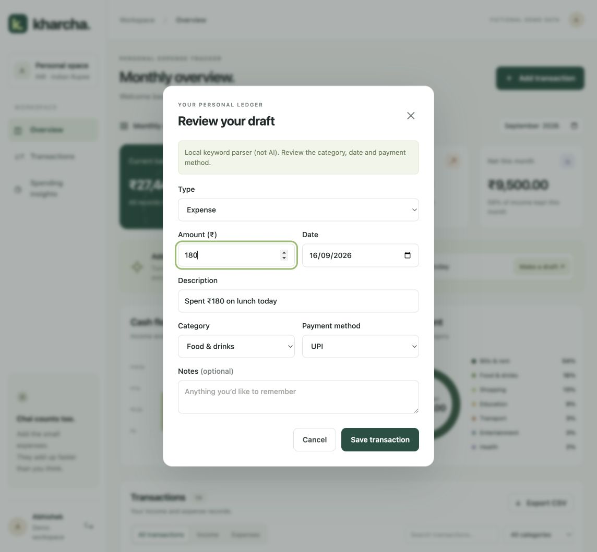
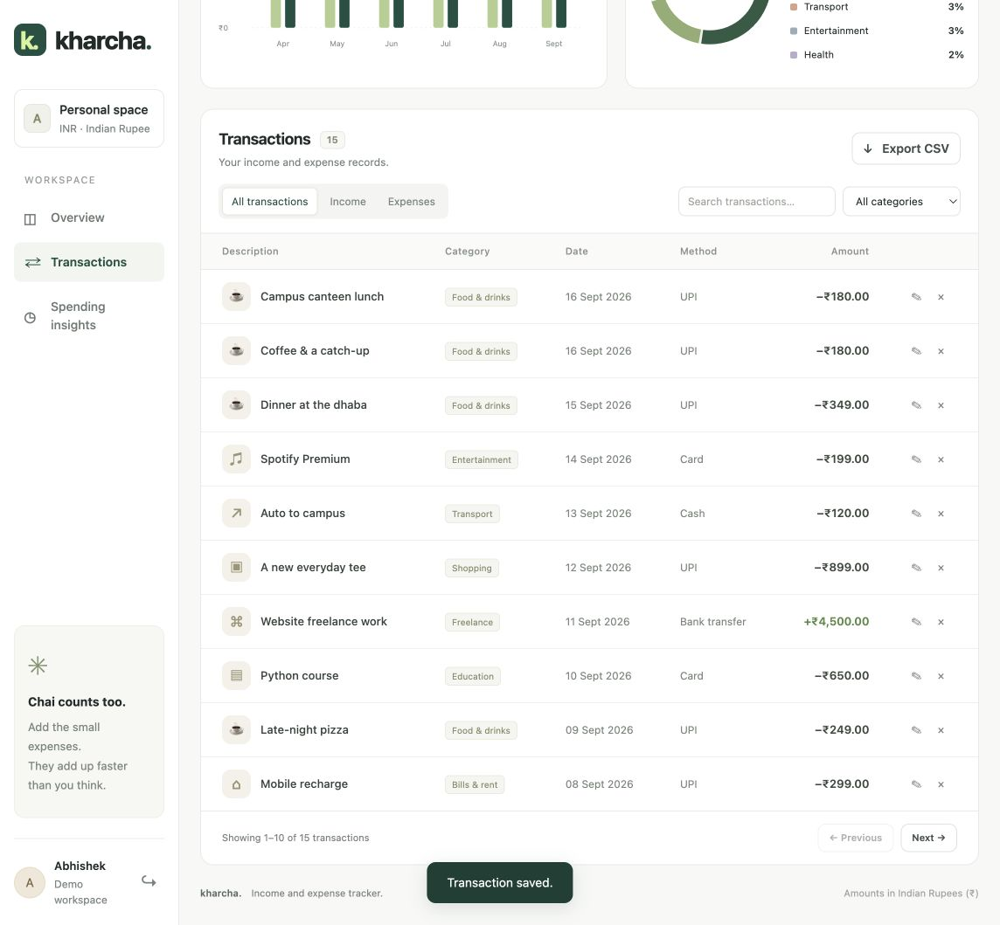
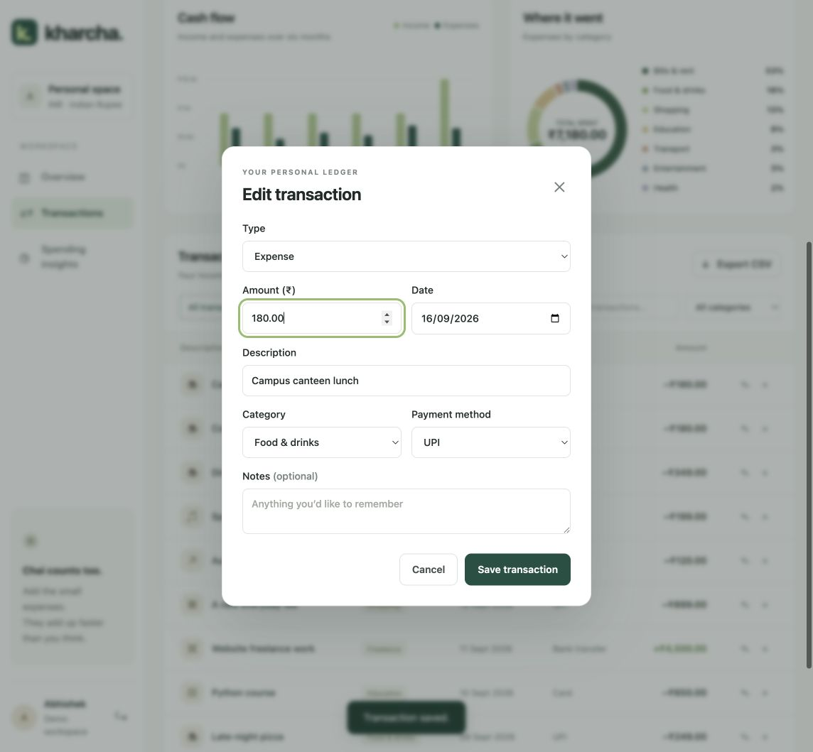
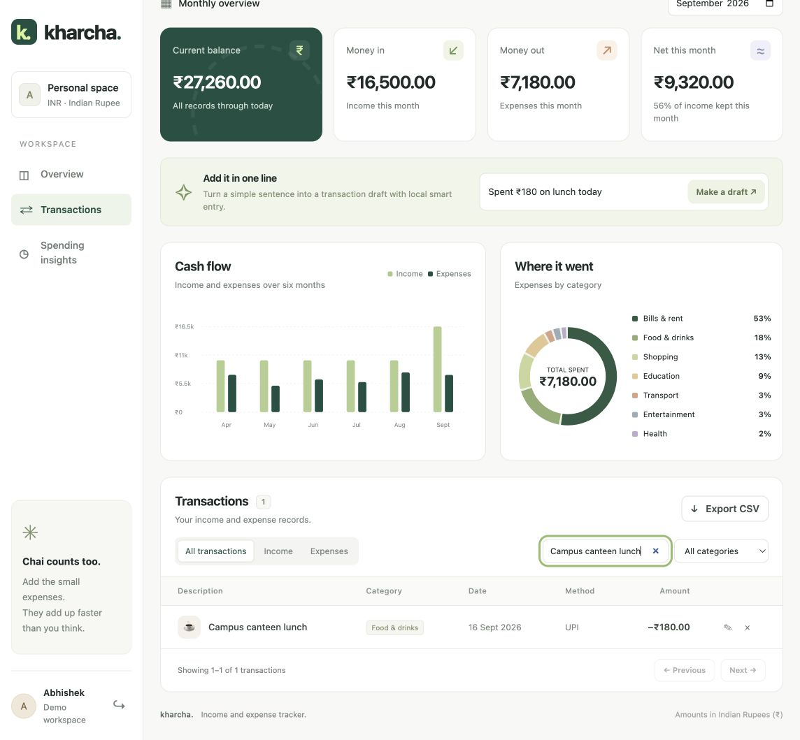
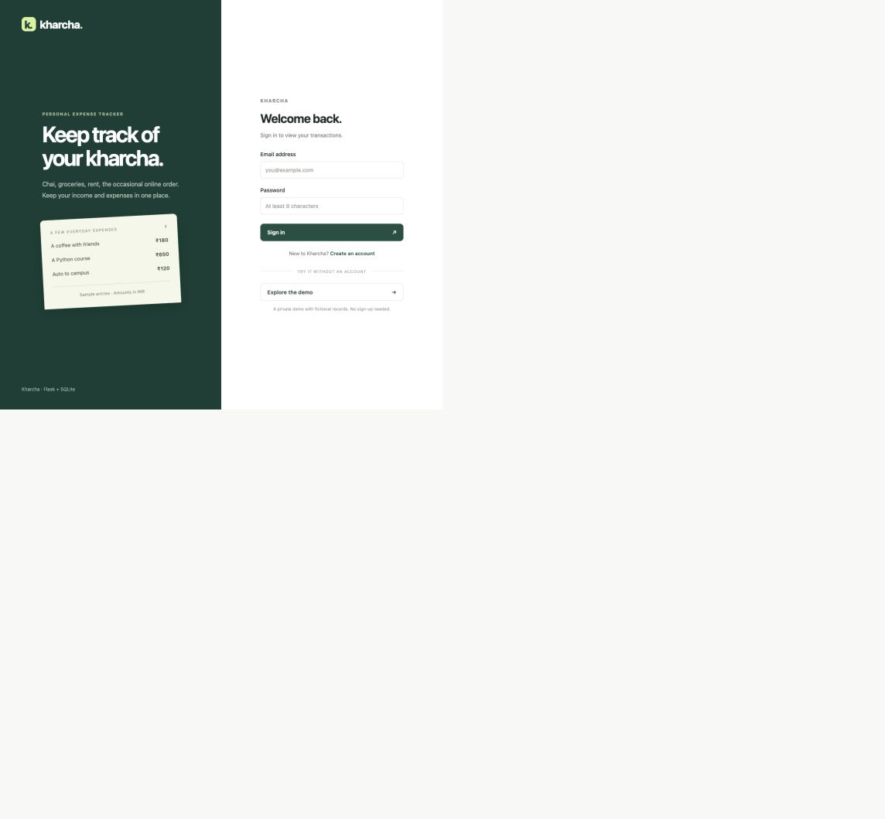

# Kharcha

An expense tracker for everyday spending — food, transport, rent, shopping — and income like an allowance or freelance payment.

Built with **Python, Flask, SQLite, HTML/CSS and vanilla JavaScript**. You can add transactions, see where your money went that month, and export the records as CSV.



## Features

- Separate income and expense entries, with edit and delete options
- Monthly totals, category breakdown and a six-month cash-flow chart
- Search, category filters and CSV export
- Login with separate records for each account
- A demo workspace with sample data
- Quick entry: type something like `Spent 180 on lunch yesterday`, review the fields, then save

Quick entry uses a small keyword parser by default. There's also an optional Gemini integration. The local parser isn't a trained model, and every draft needs review before it becomes a transaction.

## Run locally

Tested with Python 3.12.

```bash
python3 -m venv .venv
source .venv/bin/activate
pip install -r requirements.txt
flask --app wsgi run --port 5057
```

Open **http://127.0.0.1:5057**. Choose **Explore the demo** to try the sample records, or create an account to start empty.

On Windows, use `python` and activate with `.venv\Scripts\activate`. The database is created automatically in `instance/kharcha.sqlite`. That folder is ignored by Git, so your local records and session secret stay out of the repository.

## How it's put together

```text
kharcha/
  __init__.py       Flask setup, sessions and CSRF checks
  auth.py           Login, registration and demo accounts
  db.py             SQLite connections
  schema.sql        Tables, constraints and indexes
  routes.py         CRUD, summaries, export and quick-entry APIs
  validation.py     Field validation and money conversion
  smart_entry.py    Local parser and optional Gemini request
  seed.py           Sample data
  templates/       HTML pages
  static/          CSS, JavaScript and icons
tests/            API and database tests
docs/             API reference, design notes and deployment steps
```

Amounts are stored as integer paise, so ₹180.25 is `18025` in the database. Queries use SQL parameters, and each transaction belongs to a user. Monthly totals come from SQL aggregation rather than values calculated only in the browser.

[Design notes](docs/ARCHITECTURE.md) · [API reference](docs/API.md)

## Tests

```bash
pip install -r requirements-dev.txt
python -m pytest -q
```

The 41 tests cover CRUD, input validation, account isolation, CSRF, money precision, filters, CSV export, persistence and parser behavior. They use temporary SQLite databases. The GitHub Actions workflow runs the same suite.

## Optional Gemini setup

Set `GEMINI_API_KEY` in the server environment and restart. `GEMINI_MODEL` defaults to `gemini-2.5-flash-lite`; it can be changed to a model available to your account. See `.env.example` for settings. The app does not automatically load an `.env` file.

Only the entered sentence is sent to Gemini, not your transaction history. Responses are validated before being shown as drafts. If the request fails, the app tries the local parser. Demo accounts always use the local parser. A live Gemini request has not been verified yet.

## Deployment

Gunicorn, Docker Compose and Render configuration are included. A public deployment is still pending. See [deployment instructions](docs/DEPLOYMENT.md) for setup and persistent storage.

SQLite works well for this small app. It needs a persistent disk on the host; running it on an ephemeral filesystem would lose records after redeployment. Multiple server instances would need a shared database such as PostgreSQL.

## Current limits

- Predefined categories and INR only
- No bank connection, recurring entries or password reset
- Simple local parsing: one amount and today, yesterday or an ISO date
- No measured AI accuracy or performance benchmarks

Possible next additions: custom categories, a date-range filter, and monthly budgets.

## More screenshots

### Quick-entry draft


### Saving a transaction


### Editing


### Search


### Login

