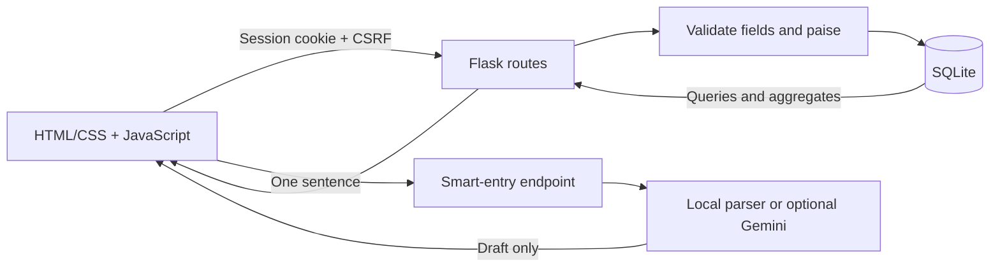
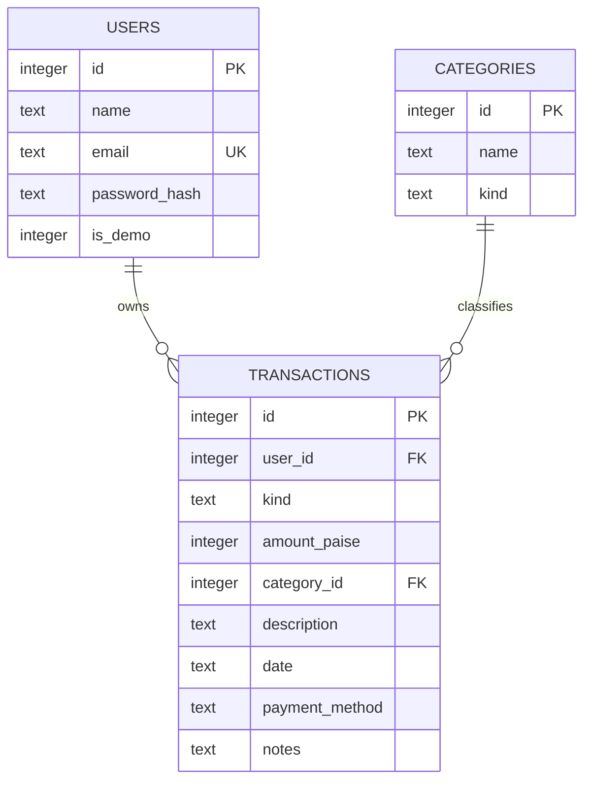

# Design notes

## Follow one transaction

1. A user fills the HTML dialog. `static/app.js` sends JSON with the session's CSRF token.
2. Flask verifies the token and loads the signed-in user from the database.
3. `validation.py` checks type, amount, description, real date, payment method and matching category.
4. The amount is converted with `Decimal` into integer paise: ₹180.25 becomes `18025`.
5. `routes.py` executes a parameterized INSERT in a transaction. The user ID comes from the session, never from client JSON.
6. SQLite enforces foreign keys and checks, then commits the record.
7. The API returns 201. The browser reloads the table and SQL-derived summaries.

The AI/parser path stops before step 1: it produces an editable draft. It has no SQL write permission of its own.

## Data model

`rate_events` is a small supporting table for request limits. It contains time-stamped buckets, not financial records.

## Main decisions

**Why Flask?** The request/response flow is small and explicit. Templates serve the page while JSON routes support interactive updates. An application factory makes each test use its own configuration and database.

**Why SQLite?** It is a real relational DBMS, included with Python, and easy to run locally. It provides transactions, constraints, indexes and persistence without another service. It is a good fit for a small single-instance app. A service with many concurrent writes or several app instances should move to PostgreSQL.

**Why write SQL instead of an ORM?** It makes schema design, joins, ownership checks and aggregation visible. Values use `?` parameters. User input is never concatenated into SQL; dynamic WHERE fragments are hard-coded clauses.

**Why integer paise?** Binary floats cannot exactly represent many decimal amounts. Validation uses `Decimal`, and SQLite stores the integer subunit. `180.25 + 19.75` becomes `18025 + 1975 = 20000`, exactly ₹200.00.

**Why categories in a separate table?** The category name is maintained once. A composite foreign key `(category_id, kind)` prevents an expense from referring to the Salary income category, even if API validation is bypassed.

**How does one user stay out of another user's data?** Every record query includes `user_id = current_user.id`, including read, edit, delete, summary and export. A missing record and another user's record both return 404. The tests use two independent signed-in clients to verify this.

**What does the index do?** `(user_id, date DESC, id DESC)` matches the common access pattern: one user's records, a date range, then newest first. Search with `instr` still scans the selected rows; there is no claim of full-text search performance.

**What are the financial totals?** Monthly net is that month's income minus expenses. Current balance is all recorded income minus expenses through the server's current date. It is a ledger total, not a fetched bank balance. Monthly records may be future-dated; the all-time current balance excludes them.

**How are accounts protected?** Password hashes use Werkzeug's scrypt default. Sessions are signed, HTTP-only and SameSite Lax. Mutations require CSRF tokens. Production mode adds secure cookies and HSTS. A restrictive content policy permits only local scripts/styles. Login attempts and parsing have SQLite-backed rate limits. Password reset and MFA are intentionally out of scope.

**What is actually AI?** The optional Gemini HTTP call is model-backed extraction. The default local code is a keyword parser, not machine learning. There is no trained model, accuracy benchmark, fraud detection or investment advice. Provider output receives the same validation as manually entered data and must be reviewed.

**What happens during failures?** Invalid requests get useful 4xx JSON errors; records are not partially written. The UI shows errors, disables duplicate submissions during requests and preserves the edit form. AI errors produce a labelled fallback draft when local parsing succeeds. SQL connection cleanup happens after each request.

